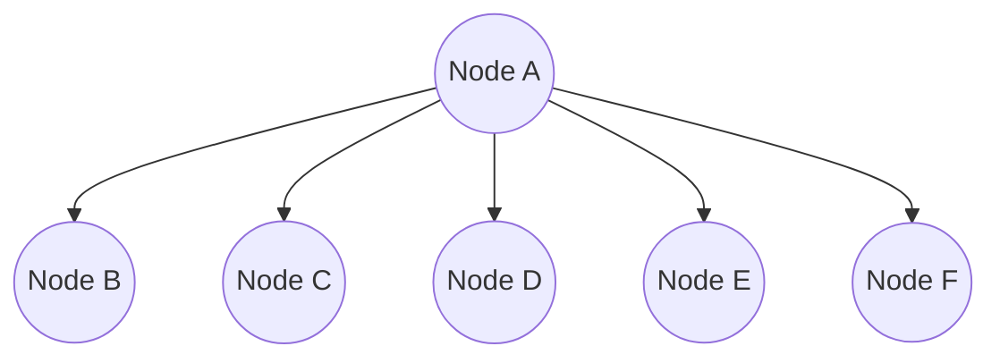
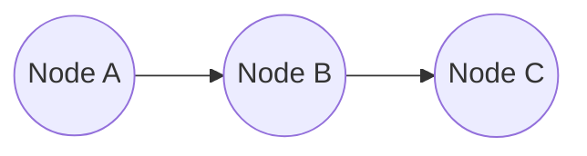
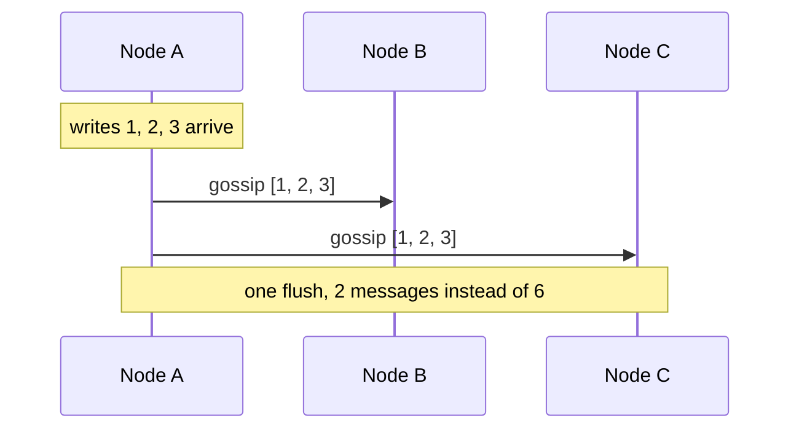
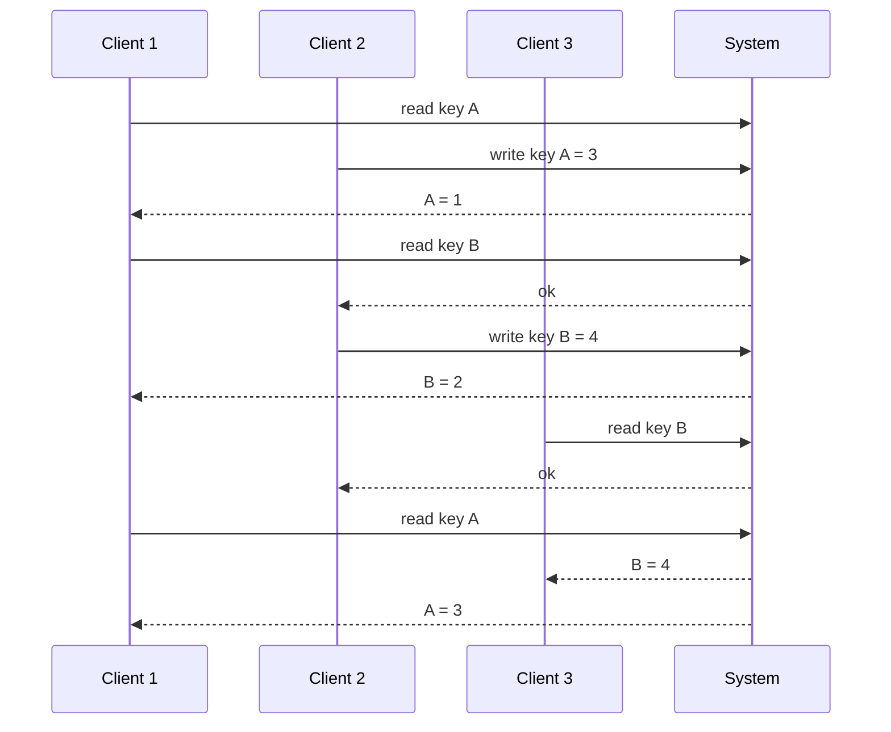
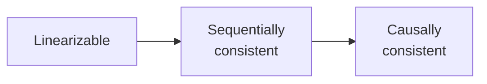
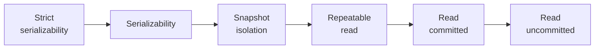
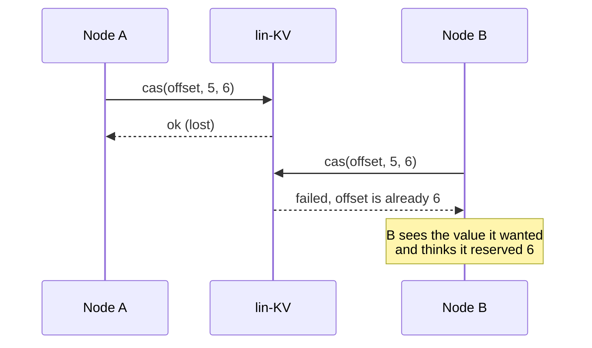
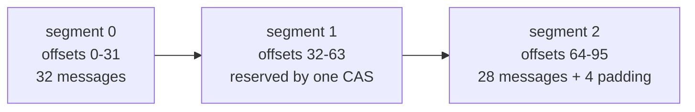
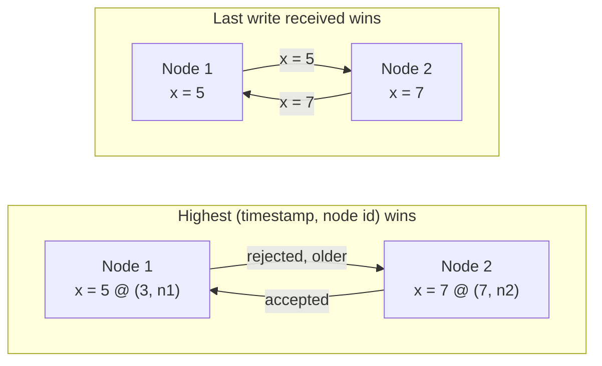

I recently spent some time working on the [fly.io distributed systems challenges](https://fly.io/dist-sys/). I mostly used this as a chance to write some more Rust code and also relive one of my favorite classes at MIT (6.824 Distributed Systems). While the scale of these challenges was definitely a lot smaller than that project, it was definitely still some fun to think about the problems and learn a bit more about different consistency models! My full code for these challenges is located [here](https://github.com/rcya1/dist-sys-challenges). In this explainer I'll be using some Python-esque pseudocode to explain my solutions

Each challenge consists of writing a program that will be run on one or more "nodes", each of which is an independent copy of your program that can receive user requests and communicate with each other via the [Maelstrom framework](https://github.com/jepsen-io/maelstrom/tree/main). I'll discuss some of the more interesting challenges + any difficulties I came across while implementing them.

One curious thing I discovered during all of these is that these tests only exercise network partitions and never node crashes. This makes the task simpler in that we don't have to worry about persisting state to disk and the associated race conditions. It was a bit disappointing to see, but fwiw I think handling it mostly requires just being careful about persisting certain local state to disk before acking to the user. Even without this, attempting to achieve total availability in the face of network partitions is still an interesting challenge.

# Challenge 1: Echo

```problem
As a getting started task, each node will receive an `echo` message and should reply with an `echo_ok` message with the same message contents.
```

This one is straightforward enough that the whole thing fits in a line:

```python
def on_echo(msg):
    reply(msg, "echo_ok", echo = msg.echo)
```

# Challenge 2: Unique Ids

```problem
Each node will receive a `generate` RPC and should respond with a globally unique ID (no other node should have generated it before). The service should be totally available.
```

One tempting way to do unique ID generation is to use one of the KV store services provided by Maelstrom to synchronize ids between nodes (i.e. have some global counter that you read and write from for every operation). However this challenge asks for **total availability**, which means that this should work even if there are network partitions between the recipient node and the KV store.

To solve this, note that while monotonic IDs can be a nice property, this problem doesn't ask for that. Instead, we maintain a separate counter per node. A nice thing about this task is that the returned IDs can be any type, not just numbers, so we can just append the node's unique id to the counter to get a globally unique id. Even if it did require integers, we could still do the concatenation with some padding + enforce some upper bound on the number of unique IDs per node. With 64 bit integers, that would be more than sufficient.

```python
counter = 0

def on_generate(msg):
    counter = counter + 1
    reply(msg, "generate_ok", id = node_id + "-" + counter)
```

# Challenge 3: Broadcast

```problem
Each node should handle two RPCs:
- `broadcast` requests a value is broadcast to all nodes in the cluster
- `read` requests all values that have been seen so far

The system should be totally available and eventually consistent.
```

This is the first task that has a significantly larger potential design space and also introduces two different objectives you should optimize for:

1. Write-to-read latency
2. Messages sent per user request

The core of this challenge is to implement **gossiping**, where when one node receives a write, it gossips that new value to all of the other nodes. Crucially, we _don't_ wait for a response to your gossips before acking the user, sacrificing some consistency for latency. The challenge just asks for _eventual consistency_, and as long as we implement retries for our gossiping, this is satisfied even in the face of network partitions. This is done by storing a table of all non-acked gossips, and periodically retrying any entries in that table that have passed a timeout.

For Objective 1, we want to minimize the write-to-read latency across different nodes (i.e. we write to `Node A` and read from `Node B`). For purely optimizing the write-to-read latency, it makes sense for `Node A` to send a message to all other $n - 1$ nodes. That way, for any other node, write-to-read latency is equal to just the worst network latency which can't be improved.



_`Node A` sends its gossip to everyone_

This is obviously pretty terrible for the network card for `Node A`. Additionally, it doesn't take into account network topology at all, which might have the `A -> C` path involve the `A -> B` hop. In that case, we would rather `Node A` just send a message to `Node B` and then `Node B` forwards that to `Node C`.



_`Node B` should forward the message to `Node C`_

While Maelstrom does give us a topology, it's actually optional and following it will result in latencies worse than the goal latencies. Instead, I just implemented the "star" pattern where `Node A` gossips to everyone to achieve the optimal latency.

For Objective 2, we want to minimize the number of messages transmitted across our network per user request. One key note is that no matter how you choose to organize your gossiping topology, $n - 1$ gossip messages will have to be sent over the network. Instead, the key is **buffering**. When we receive a user request, rather than immediately sending out the gossip requests, we add them to a buffer. We then periodically flush this buffer, allowing multiple user requests to build up before sending them all together to all neighboring nodes.

Buffering increases the latency though, introducing a natural tradeoff between minimizing network traffic and minimizing latency.



My final code:

```python
seen = set()
buffer = []
pending_gossips = []

def on_broadcast(msg):
    seen.add(msg.value)
    buffer.add(msg.value)
    reply(msg, "broadcast_ok")

def on_read(msg):
    reply(msg, "read_ok", messages = seen)

def on_gossip(msg):
    seen.add_all(msg.values)
    reply(msg, "gossip_ok")

def on_gossip_ok(msg):
    pending_gossips.remove(msg.gossip)

def flush_gossips():
    if buffer is empty:
        return
    for peer in other_nodes:
        pending_gossips.add(send_gossip(peer, buffer))
    buffer.clear()

scheduleEvery(flush_gossips, FLUSH_INTERVAL)

def retry_gossips():
    for gossip in pending_gossips:
        if now - gossip.sent_at > TIMEOUT:
            resend(gossip)

scheduleEvery(retry_gossips, RETRY_INTERVAL)
```

# Challenge 4: Grow Only Counter

```problem
Each node should handle two RPCs:
- `add` adds a value to a global counter to be shared across all nodes
- `read` returns the value of the global counter.

The system should be sequentially consistent.
```

This was the first challenge that made use of Maelstrom's KV stores, which are totally available services offering varying levels of consistency models.

## Consistency Models

First, it's good to be precise about what a "consistency model" really is.

```definition
A **history** is a set of operations each with an invocation time, a response time, a client that issued it, and results.
```



_An example history with three clients, where time runs downwards_

```definition
A **consistency model** is a predicate over histories, or a rule that says which histories are "legal".
```

One thing worth pointing out is that the notion of consistency models changes depending on whether we are dealing with a service that offers **transactions**. Transactions allow you to bundle operations together, typically with the ability to rollback or atomically commit all actions at once.

Some examples of consistency models in non-transaction systems are:

- Linearizable
- Sequentially consistent
- Causally consistent

Some examples of consistency models in transactional systems are:

- Strict serializability
- Serializability
- Snapshot isolation
- Repeatable read
- Read committed
- Read uncommitted

These consistency models can be placed on a chart, where the models go from strongest (left) to weakest (right) and every model on the left is a strict subset of all models on the right. This means that all linearizable systems are sequentially consistent, all sequentially consistent systems are causally consistent, etc.



_Without transactions, where each model is a strict subset of everything to its right_



_With transactions_

For now, we focus on non-transaction systems, but we'll discuss transaction systems more in [Challenge 6](#challenge-6-totally-available-transactions).

### Linearizable vs Sequential Consistency

Maelstrom offers three KV store services in total: a linearizable one, a sequential one, and last-write-wins ones. Here I won't talk about the last one since by Maelstrom's docs own words, it is an "intentionally pathological... key-value store". It doesn't provide any useful consistency guarantees. Instead, we focus on the first two.

In both **linearizable** and **sequentially consistent** systems, there must be a single total order across all operations. That is, we can place every operation across all clients into an ordered list and pretend as if they all occurred in exactly that order. Then, both consistency models demand that every read reflects the results of all previous writes.

For instance, in this sample history from before, we can define the following order which satisfies that reads observe every write.

1. Client 1 reads key A = 1
2. Client 2 writes key A = 3
3. Client 1 reads key B = 2
4. Client 2 writes key B = 4
5. Client 3 reads key B = 4
6. Client 1 reads key A = 3

Note that neither consistency model gives a procedure for how to come up with such ordering. Instead, it just demands that it is possible to pick out **a** valid ordering subject to the following constraints.

For sequentially consistent systems, the total order must also respect **program order**.

```definition
Under **program order**, each client's operations must appear in the total order in the order that the client issued them.
```

For instance, the following total order would be invalid:

1. Client 1 reads key A = 1
2. Client 2 writes key A = 3
3. Client 1 reads key A = 3
4. ...

We cannot have our total order skip client 1's read for B. Note that this makes no restriction over the order _across clients_.

For linearizable systems, we have a stronger constraint: the total order must respect **real time**.

```definition
Under **real time**, if operation X finishes before operation Y begins, then operation X **must** appear before operation Y in the total order.
```

Note that this implies program order. Under this, the following total order would be invalid:

1. Client 1 reads key A = 1
2. Client 1 reads key B = 2
3. Client 2 writes key A = 3
4. Client 2 writes key B = 4
5. Client 1 reads key A = 3
6. ...

The total order must have client 2's write come after client 1's final read since client 1's read finished before client 2's write began.

---

Linearizable systems have the strongest constraints that are what one might typically assume when building systems. If we have written to a KV store (i.e. we take a lock), after our write returns, we want all other clients to observe that we hold the lock and not try to take it for themselves. Sequentially consistent systems don't give us that guarantee, but tell us that if **we** try to re-read the KV store, we will always see the result of our write, even if it may be delayed for others.

One particular quirk about these consistency models is that they only provide guarantees on the **safety / ordering axis** and not on the **liveness axis**.
The distinction is apparent when considering **eventual consistency**, or the idea that any write you make will _eventually_ be seen by every other client. Despite how strong sequential consistency is, it does **not** provide eventual consistency! This is because there are no guarantees between clients, so if client 1 does a write and client 2 repeatedly reads it until the end of time, a valid sequentially consistent ordering would be to put all of those reads before the write.

As an extreme example, consider a KV store that shards users based on their client ID. We can completely separate all users and serve each user their own view of the KV store with absolutely no synchronization, and this provides sequential, but not eventual, consistency! While every practical real world application will provide eventual consistency as well, it is worth noting that this technically does not work.

Why would anyone want sequentially consistent systems? The short answer is performance. Providing linearizable systems requires a lot of synchronization because you have to make sure that writes to a key are completely flushed to every reader server before you can serve a read for any client. For sequentially consistent systems, you only have to worry about that for one client, and you can do some work to manage which reader servers / caches that client will connect to.

### How to Achieve Consistency

For linearizable systems, the real-time constraint is quite expensive since once your write returns, everyone else has to see it. Some ways of achieving this are:

- Single designated leader
  - All writes go through one node, and it only acks once all reader servers have applied that write.
  - This bottlenecks the throughput to that of one node and leads to issues if that node crashes
- Consensus protocols like [Raft](https://raft.github.io/raft.pdf)
  - A leader is elected and writes are replicated to a log that all nodes agree on
  - Reads can be served by the leader (this comes with some complications involving ensuring that the leader is still the leader when answering read requests, but it is doable)
- TrueTime ([Google Spanner](https://research.google/pubs/spanner-googles-globally-distributed-database-2/))
  - Uses atomic clocks + bounded clock uncertainty to get guarantees without requiring coordination

For sequentially consistent systems, we get a bit more freedom because we can be a bit more lax with reads. The textbook example is [ZooKeeper](https://www.usenix.org/legacy/event/atc10/tech/full_papers/Hunt.pdf).

- Writes are strictly totally ordered through a consensus protocol
- Reads are served locally from whichever follower you're connected to
- Writes and reads done in the same session are connected to the same follower, so a session's reads are guaranteed to see its writes
- If you crash / have to restart a new session, then the writes from your previous session are not necessarily visible

For ZooKeeper, you can use `sync()` to guarantee a genuinely fresh read, which gives opt-in linearizability if you want to guarantee that you have seen all other writes.

There are still other real-world, useful systems that don't provide sequential consistency in exchange for availability / low latency:

- DNS
  - There are a ton of caches / TTLs at various points in the DNS service, so a change made at the authoritative server reaches different resolvers at wildly different times
  - So there are no guarantees of any readers being able to see DNS changes in a particular order
  - Entirely just relies on eventual consistency
- [Amazon Dynamo](https://www.allthingsdistributed.com/files/amazon-dynamo-sosp2007.pdf)
  - Uses a quorum system to provide better latency / availability by only replicating to a subset of other nodes
  - Relies on eventual propagation / convergence via its vector clock, last-write-wins conflict handling

## The Actual Challenge

There are two approaches we can take to solve the global counter problem.

### Solution 1

First, we could use a compare and swap (CAS) loop. When attempting to increment the counter, it is possible that multiple user requests attempt to increment at the same time. To prevent a scenario where two requests both read value `x` and then both write `x + 1` at the same time (resulting in an increment of `1` instead of `2`), we use the CAS functionality of the KV stores.

A CAS operation takes a key, old value, and new value, and then only does the update if the old value you give matches the actual value in the KV store. That way, if two nodes try to make the update `x -> x + 1`, only the first CAS will succeed. The second node will then loop, re-reading the key and re-attempting the CAS repeatedly until it succeeds.

For this, do we need a linearizable KV store, or can we settle with sequential? Since we only need sequential semantics for our counter, it may seem like sequential is sufficient. But this is actually false because in sequential KV stores, CAS operations are not guaranteed to work across different clients. If two user requests hit the same node and were processed concurrently, they would maintain proper CAS semantics. But if they hit separate nodes, they can both make the update `x -> x + 1` at the same time. As a result, this CAS solution only works with the linearizable KV store.

This means that this solution actually achieves a linearizable global counter, which is more strict than the desired sequential one. Since it's a subset, this solution is valid, but we can do better in terms of latency.

```python
def on_add(msg):
    x = lin_kv.read(COUNTER)
    while not lin_kv.cas(COUNTER, x, x + msg.delta):
        x = lin_kv.read(COUNTER)
    reply(msg, "add_ok")

def on_read(msg):
    reply(msg, "read_ok", value = lin_kv.read(COUNTER))
```

### Solution 2

To make use of a sequential KV store, the key is we can't rely on cross-node consistency. Instead, we keep a counter per node. Each increment operation just increments that node's key in the sequential KV store, and when we do a read operation, we fetch all other nodes' counters from the sequential KV store and add them.

As an optimization, we can store our local node's counter in memory and not re-fetch it from the KV store each time we do a read. I didn't implement this, but another potential optimization could also do some caching of counter values for other nodes. After all, we only need to be sequentially consistent so we can afford to have stale caches for the other nodes' counters.

```python
local = 0

def on_add(msg):
    local = local + msg.delta
    seq_kv.write(node_id, local)
    reply(msg, "add_ok")

def on_read(msg):
    total = local
    for peer in other_nodes:
        total = total + seq_kv.read(peer)
    reply(msg, "read_ok", value = total)
```

# Challenge 5: Kafka

```problem
Implement a Kafka-style append-only log. Each log is identified by a key and contains a series of messages, each of which is identified by an integer offset. Offsets can be sparse (i.e. every offset does not have to have an associated message). Offsets must be unique across logs. This involves two RPCs:
- `send`: gives a `msg` that should be appended to the log identified by `key`. The response should contain a unique offset for the message in the log.
- `poll`: requests all messages from a set of logs starting from a given offset in each log.

Clients can also commit offsets, indicating that they have successfully processed through a given offset. The service should store these and return them to clients. If clients read according to their commits, they should never miss a write to the logs. This involves two RPCs:
- `commit_offsets`: gives a set of keys and corresponding offsets that indicate the logs have been read up until those offsets
- `list_committed_offsets`: gives a set of keys and expects the corresponding committed offsets

There is no recency requirement, but updates should never be lost as we read the log.
```

For this challenge, the easier part is to consider committing offsets. From the requirements, we know there is no recency requirement, and we need to ensure that if a user commits an offset, we don't ever cause them to miss a read by giving them back an offset they committed. Giving a stale offset that is **lower** is fine, since this just causes re-reading updates.

As a result, the bounds are pretty loose and we can simply use the sequential KV store to store the committed offsets. The only optimization I did on top of the naive put and read was to add a caching layer on top of the sequential KV store with a short TTL. The reads are already potentially stale, so adding 200ms of staleness works fine and helps reduce the messages per user operation (the main metric I optimized for in this challenge).

```python
def on_commit_offsets(msg):
    for key, offset in msg.offsets:
        seq_kv.write(committed(key), offset)
    reply(msg, "commit_offsets_ok")

def on_list_committed_offsets(msg):
    result = {}
    for key in msg.keys:
        result[key] = cached_read(committed(key), CACHE_TTL)
    reply(msg, "list_committed_offsets_ok", offsets = result)
```

Handling `send` and `poll` were a bit more tricky, since we have to assign a globally unique offset. The simplest way to do this is to use the linearizable KV store and its CAS functionality. With this, we can atomically set `offset := offset + 1` and assign `offset` to the message just received. Specifically, the uniqueness constraint requires us to use the linearizable KV store since two clients talking to different nodes must not receive the same offset, requiring linearity.

To improve this solution, we can also implement a bit of caching. A typical CAS loop looks like:

```python
x = read(key)
while not CAS(key, x, x + 1):
    x = read(key)
    continue
```

Rather than starting each loop by reading the key's value, we can cache the value from the last iteration, saving a read operation in the case where no other node has concurrently edited this key.

```python
x = cached(key)
while not CAS(key, x, x + 1):
    x = read(key)
    continue
```

In my code, I don't just store the offset though because of a subtle race condition. When we send a CAS and it fails, it is possible that the operation has actually succeeded. For instance, if we first attempt a CAS, it times out, and then we attempt a CAS again, the second CAS might fail because the first one succeeded late and its acknowledgement was lost. In this case, we should actually end the CAS loop. However, what happens if two nodes concurrently try to reserve an offset? If `Node A` and `Node B` both attempt a CAS and then `Node A` succeeds, then `Node B` will see that the offset was updated to what it wanted and mistakenly believe that it successfully reserved the offset when it didn't. Because of this, we have to ensure that different nodes do not attempt to write the same value, so rather than just writing a number, we write both the offset **and** the node id that is attempting to reserve.



Another way we can save messages on the `send` message is once again through batching. When we receive `send` messages, similar to Challenge 3, we batch them and only flush when either our batch is large enough or a timeout has passed. We then do a single CAS loop to add every buffered message at once, allocating a range of offsets instead of just a single offset.

This handles the offsets, but how do we store the actual log of values and keep it atomically consistent with the offset? In my initial implementation I did the simplest thing where rather than just storing the offset, I stored the entire log + offset together as a single value. This pretty obviously doesn't scale, especially since many databases have limits on how big the values you store are (on the order of O(10) MB). However, if we store them in separate KV pairs, then we can't atomically store the new offset + data at the same time, meaning there is a point in time where people can interleave operations between us setting the new offset + storing the messages.

The key is that we don't need to store these atomically with the reservation. We can first do a CAS operation on the linearizable KV store to reserve up to an offset. Then, we can store each individual offset's message separately and without worry about other clients using the same offset since we already reserved it with the CAS.

This leads to some tricky challenges though now that we have separated offset from message storage. Consider what happens when you read that offsets have been reserved up to 30, and then you attempt to read message 25 in the KV store and you see nothing. Is it safe to assume this is just the KV store being stale / the writer is slow and just wait for this data to eventually show up? In our world where we assume no permanent node failures / network partitions, we could, but if there is a writer experiencing a long network partition, then this could block the entire system for that key. Instead, we should just skip them rather than stalling for that writer to recover.

To do so, we allow the `poll` implementation to time out waiting for messages to be filled in. Before a `poll` does this, it should first CAS an `abandoned` message into that message offset to indicate that it skipped that offset. That way, the writer, when it recovers, will fail its CAS, see the `abandoned` message, and then fail the write.

Put together, that gives us a version where each message lives in its own key:

```python
def on_send(msg):
    offset = reserve_offset(msg.key)
    lin_kv.write(message(msg.key, offset), msg.msg)
    reply(msg, "send_ok", offset = offset)

def reserve_offset(key):
    current = cached_offset(key)
    mine = reservation(current.offset + 1, node_id)
    while not lin_kv.cas(latest_offset(key), current, mine):
        current = lin_kv.read(latest_offset(key))
        if current == mine:
            break
        mine = reservation(current.offset + 1, node_id)
    return mine.offset - 1

def on_poll(msg):
    result = {}
    for key, start in msg.offsets:
        end = lin_kv.read(latest_offset(key)).offset
        result[key] = in_parallel(read_message(key, offset)
                                  for offset in range(start, end))
    reply(msg, "poll_ok", msgs = result)

def read_message(key, offset):
    m = wait_until_written(message(key, offset), TIMEOUT)
    if m is missing:
        lin_kv.cas(message(key, offset), nothing, ABANDONED)
        return nothing
    return m
```

This works, but it's pretty inefficient since on every `poll` that returns $n$ messages, we need to do $n$ calls to the linearizable KV store. To make this more efficient, we don't use a single key-value pair for each message and instead store messages in **segments** (I chose `SEGMENT_SIZE=32`) where each segment is a batch of offsets stored in the same KV store. The max segment size is the same as the max amount of messages that can be buffered before triggering a flush (so each flush publishes exactly one segment). This means when reading and writing a large number of values in the same flush, we can cut down the number of reads / writes to the KV store by up to a factor of 32. This does introduce some sparsity where we can potentially reserve `SEGMENT_SIZE - 1` more offsets than we need (i.e. in the case where a flush just pushes one value), but this is always strictly better than storing each message individually.



_One CAS reserves a whole segment, so a flush costs one read and one write_

One natural question is: why choose a fixed segment size over just variable-length segments? I.e. if we were flushing `28` values, why reserve + publish a full segment of size `32` instead of just writing a segment of size `28`? I chose not to do this because this would mean when we read from an offset, we won't know what's the offset to look up for the second segment until we know the length of the first one. This means we would have to wait until the read for the first segment succeeds. Also, if the user provides an offset `> 0` we would have to read all segments starting at offset `0` to figure out what the segment boundaries are. This could be solved by storing an index, but then that would have to be stored somewhere and read in whenever we do a write / read.

`poll` is more straightforward to implement. We read the latest offset and then read in parallel all segments between the requested offset and the latest offset. There is a cache on top of the segments since they are immutable once written, so we don't have to reread segments we already know about. When we process `send`, we also write to this cache so that if we `poll` from the same node we did `send` from, we don't have to round trip to the KV store. Finally, as briefly described above, if we see an empty segment, we block until a timeout has passed. If the timeout has passed, we attempt to CAS in an `abandoned` message and then continue.

Here's my final solution (with the committed offsets code from earlier as well):

```python
def on_send(msg):
    buffer[msg.key].add(msg)
    if buffer[msg.key] is full:
        flush(msg.key)

def flush(key):
    batch = buffer[key].take_all()
    base = reserve_segment(key)
    lin_kv.write(segment(key, base), batch)
    cache[segment(key, base)] = batch

    offset = base
    for m in batch:
        reply(m, "send_ok", offset = offset)
        offset = offset + 1

def flush_all():
    for key in buffer:
        flush(key)

scheduleEvery(flush_all, FLUSH_INTERVAL)

def reserve_segment(key):
    current = cached_offset(key)
    mine = reservation(current.offset + SEGMENT_SIZE, node_id)
    while not lin_kv.cas(latest_offset(key), current, mine):
        current = lin_kv.read(latest_offset(key))
        if current == mine:
            break
        mine = reservation(current.offset + SEGMENT_SIZE, node_id)
    return mine.offset - SEGMENT_SIZE

def on_poll(msg):
    result = {}
    for key, start in msg.offsets:
        end = lin_kv.read(latest_offset(key)).offset
        segments = in_parallel(read_segment(key, base)
                               for base in every_segment_between(start, end))
        result[key] = everything_at_or_after(segments, start)
    reply(msg, "poll_ok", msgs = result)

def read_segment(key, base):
    if segment(key, base) in cache:
        return cache[segment(key, base)]
    seg = wait_until_written(segment(key, base), TIMEOUT)
    if seg is missing:
        lin_kv.cas(segment(key, base), nothing, ABANDONED)
        return empty
    cache[segment(key, base)] = seg
    return seg
```

# Challenge 6: Totally Available Transactions

```problem
Implement a KV store with transactions consisting of read and write operations. Transactions can be aborted and should follow a read-committed consistency model.

The service should be totally available.
```

## Transaction Consistency Models

Previously we went over consistency models in non-transaction systems, and now we consider systems with transactions. The key difference in transaction systems is that multiple operations can be bundled into one, and these models govern what these transactions are allowed to see about concurrent transactions. For instance, `Transaction A` might consist of multiple reads and then a write and a concurrent `Transaction B` might be doing a read and multiple writes to the same keys. How much of the effects of `Transaction B` is `Transaction A` allowed to see? Is it allowed to see none of its writes, or some of its writes? If `Transaction A` sees `Transaction B`'s writes, then is `Transaction B` allowed to see `Transaction A`'s writes? That is governed by these transaction consistency models.

As a reminder, here are some of the transaction consistency models in order from strongest to weakest.

- Strict serializability
- Serializability
- Snapshot isolation
- Repeatable read
- Read committed
- Read uncommitted

**Strict serializability** and **serializability** are two of the strongest models, and both of them say that all transactions must appear as if they all ran one at a time in some order. Strict serializability has an extra condition, which is that this transaction order must follow real world time semantics (very similar to linearizable vs sequential when talking about non-transaction consistency models). The easiest way to implement this is to have a single global coordinator that orders these transactions.

**Snapshot isolation** says that every read in the transaction will be done from a consistent snapshot taken at some point in time before the transaction started. When it is time to make writes, it is checked that the values in those keys are consistent with the original snapshot. This is vulnerable to "write skew", which is when two concurrent transactions both read the same data (i.e. that a conference room is free) and then both book it for two different people in a separate table. As long as both transactions write to disjoint areas in the database, they can both succeed and double book the room.

**Repeatable read** can vary based on the database engine you use, but the core idea is that once the transaction has read a row, it is guaranteed that it will read the same value if it re-reads that row within the same transaction (so the read is repeatable). This is typically done via row locks or by using some kind of versioning so the transaction can serve old versions of a row if they are concurrently edited. This can lead to write skew and also "phantom reads", where if the transaction includes range queries (i.e. get all rows between yesterday and today), then new rows will not be locked. Therefore when we redo our range query, we can get brand new rows that we didn't previously see in the transaction.

**Read committed** is the default in PostgreSQL and SQL Server, and it says that you will never get "dirty reads", which are reads that a concurrent transaction has written but not committed.That is, all reads you make will only be of values that have been committed by some transaction. So if concurrently running transactions commit, you can see those effects as you progress through the operations of your transaction. This means you can get non-repeatable reads, which means you can read key `x` at the beginning of the transaction and then re-read it at the end of the transaction and see different results.

**Read uncommitted** gives almost no isolation guarantees at all and is rarely used today. It only prohibits "dirty writes", which is where two transactions modify the same object concurrently. For instance, if key `x` holds an array, `Transaction A` appends `1`, then `Transaction B` concurrently appends `2`, and finally `Transaction A` appends `3`, then a resulting value of `[1, 2, 3]` would be illegal.

As a summary, there are various anomalies, each of which are prevented by certain consistency models:

- Dirty writes: Transactions `A` and `B` modify the same object concurrently
- Dirty reads: Transaction `A` reads a value that has not been committed yet by any transaction
- Non-repeatable reads: Transaction `A` reads a value at the beginning of the transaction and finds a different value later in the transaction without having written to it
- Phantom reads: Transaction `A` sees new rows appear while doing a range query
- Write skew: Transactions `A` and `B` write to different objects but violate some invariant spanning both objects

Putting those together, each model is defined by which anomalies it rules out:

| Model                  | Dirty writes | Dirty reads | Non-repeatable reads | Phantom reads | Write skew |
| ---------------------- | :----------: | :---------: | :------------------: | :-----------: | :--------: |
| Read uncommitted       |      X       |             |                      |               |            |
| Read committed         |      X       |      X      |                      |               |            |
| Repeatable read        |      X       |      X      |          X           |               |            |
| Snapshot isolation     |      X       |      X      |          X           |       X       |            |
| Serializability        |      X       |      X      |          X           |       X       |     X      |
| Strict serializability |      X       |      X      |          X           |       X       |     X      |

Note that strict serializability rules out the same anomalies as serializability. The only difference between them is the real time constraint, which isn't an anomaly.

## Challenge

Luckily, this challenge only requires us to implement the second-to-weakest consistency model: read committed. While one might reach for some solution that requires using the KV stores / trying to implement atomically committing multiple keys at once, we can actually get away with something exceedingly simple. The read committed model just stipulates that as we process a transaction, our writes are not visible to any other nodes before they are committed.

We do this by making each node process transactions it receives sequentially and then having each node apply the results of its transactions to its local cache. This way, there is no chance for having dirty reads or writes before we commit the transaction because every node runs only one transaction at a time, and the nodes do not communicate while in the middle of running a transaction.

Then when we do commit, we respond to the client and gossip the transaction results to the rest of the cluster. There is no latency requirement, so even if this gossip gets lost and has to be retransmitted, we can afford to ack the client before guaranteeing that all other nodes have seen this transaction's result. There is also no guarantees that the ordering of the transactions has to be consistent across nodes, so each node just adopts a "last write received wins" policy where it just takes the latest write it saw for a key as its value.

To handle if a node gets partitioned / if a node is added / if a node is restarted, we also add some anti-entropy syncs. A node on startup and periodically will pull a full snapshot of the KV store from its peer and then merge it into its own. This way, if a gossip gets lost, we can over time converge towards a state where all nodes know about all writes.

There is one subtle issue with this, and that's that this system does not eventually converge (aka is not eventually consistent). Say `Node 1` handles a transaction writing `x = 5` and at the same time `Node 2` handles a transaction writing `x = 7`. They then both gossip to each other and they write each other's results as the source of truth. Then, the anti-entropy continually runs and if they are synced up / due to poor network conditions, they can constantly just swap the values back and forth. While this could be solved practically by jittering the anti-entropy syncs, a better solution is to be able to globally order the writes so we can reject writes that are "older". Since timestamps can conflict, we combine both the timestamp and node id. If a write is received with an earlier timestamp, or the same timestamp but a lower node id, we don't take the new write. This way, the state of our system will converge to all of the versions of values with the highest timestamp + node id.

```python
def on_txn(msg):
    with one_txn_at_a_time:
        result = []
        writes = {}
        for op, key, value in msg.txn:
            if op is read:
                result.add(read(key, writes, store))
            else:
                writes[key] = value
                result.add(write(key, value))

        stamp = version(now, node_id)
        for key, value in writes:
            apply(key, value, stamp)

    reply(msg, "txn_ok", txn = result)
    for peer in other_nodes:
        send(peer, "replicate", writes = writes, stamp = stamp)

def apply(key, value, stamp):
    if key not in store or store[key].stamp < stamp:
        store[key] = versioned(value, stamp)

def on_replicate(msg):
    for key, value in msg.writes:
        apply(key, value, msg.stamp)
    reply(msg, "replicate_ok")

def anti_entropy():
    for key, entry in snapshot_of(random_peer()):
        apply(key, entry.value, entry.stamp)

scheduleEvery(anti_entropy, ANTI_ENTROPY_INTERVAL)
```



_Without a global order the two nodes swap values forever, so writes carry a stamp_

With that, we're done! This was comparatively **much** simpler than the Kafka challenge which was a bit of a let down since this was the last challenge. But I still learned a lot about the different transaction consistency models.

# Final Thoughts

Overall, I thought these challenges were quite fun to think through.

In particular, I didn't really have a good grasp of consistency models and felt that thinking through these (and the process of writing this blog) really helped solidify that understanding! I especially enjoyed Challenge #5: Kafka-Style Log. Starting off with the simplest implementation of keeping the entire log in a single key and then slowly separating out the message storage into individual keys and then implementing segmentation was quite a fun process (albeit with some painful debugging).

Some of the specifications in the challenges were a bit loose, and it would've been nicer to have more concrete explanations. For instance, I felt the explanation of the committed offsets in the Challenge #5: Kafka-Style Log was quite confusing and took me a while to figure out what was going on. Also, it looks like `-nemesis partition` in the challenge doesn't do anything and so it doesn't actually really test your app in the face of partitions from the KV store. I ended up coding as if this was the case, but since I wasn't able to run it maybe there are race conditions I don't know about T_T. But regardless, thinking about them and pretending they were there was definitely a rewarding exercise!

I also found it fun to build my own framework for writing Maelstrom apps in Rust without using an existing API. It definitely took a bit of time to parse through the Maelstrom specification and it didn't help that this was the first time I was using Rust in 2 years and the first time I ever did async rust code, but it was definitely a rewarding experience (albeit a bit painful that it took so long to get through just the first exercise).

I would definitely recommend anyone interested in trying the challenges to do it themselves!
